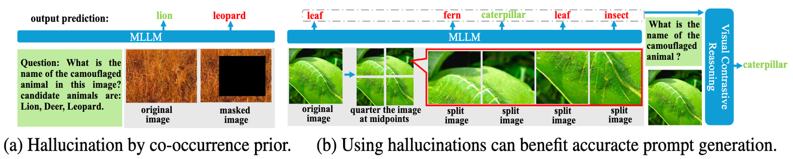
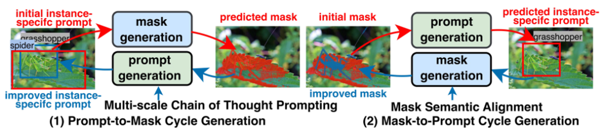
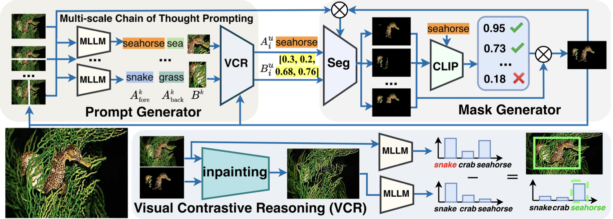

# :fire: ProMaC: Leveraging Hallucinations to Reduce Manual Prompt Dependency in Promptable Segmentation

Code release of paper:

[**Leveraging Hallucinations to Reduce Manual Prompt Dependency in Promptable Segmentation**](https://arxiv.org/abs/2408.15205)

[Jian Hu](https://lwpyh.github.io/), [Jiayi Lin](https://jylin8100.github.io/), [Junchi Yan](https://thinklab.sjtu.edu.cn/), [Shaogang Gong](http://www.eecs.qmul.ac.uk/~sgg/)

Queen Mary University of London, Shanghai Jiao Tong University

<a href='https://arxiv.org/abs/2408.15205'></a> 
<a href='https://lwpyh.github.io/ProMaC/'></a>
<a href='#demo'></a>

## :rocket: News
* **[2024.08.30]** Model running instructions with LLaVA1.5 on CAMO and COD10K datasets are released.
* **[2024.08.26]** [Demo](#demo) of ProMaC is released.
* **[2024.08.26]** Model running instructions with LLaVA1.5 on CHAMELEON dataset is released.

</p>
<p align="center">
  
</p>

## :bulb: Highlight

Promptable segmentation typically requires instance-specific manual prompts to guide the segmentation of each desired object.To minimize such a need, task-generic promptable segmentation has been introduced, which employs a single task-generic prompt to segment various images of different objects in the same task.Current methods use Multimodal Large Language Models (MLLMs) to reason detailed instance-specific prompts from a task-generic prompt for improving segmentation accuracy. The effectiveness of this segmentation heavily depends on the precision of these derived prompts. However, MLLMs often suffer hallucinations during reasoning, resulting in inaccurate prompting. While existing methods focus on eliminating hallucinations to improve a model, we argue that MLLM hallucinations can reveal valuable contextual insights when leveraged correctly, as they represent pre-trained large-scale knowledge beyond individual images. In this paper, we utilize hallucinations to mine task-related information from images and verify its accuracy for enhancing precision of the generated prompts. 

<p align="center">
  
</p>
A brief introduction of how we ProMaC do!

<p align="center">
  
</p>
Specifically, we introduce an iterative Prompt-Mask Cycle generation framework (ProMaC) with a prompt generator and a mask generator. The prompt generator uses a multi-scale chain of thought prompting, initially exploring hallucinations for extracting extended contextual knowledge on a test image. These hallucinations are then reduced to formulate precise instance-specific prompts, directing the mask generator to produce masks consistenting with task semantics by mask semantic alignment. The generated masks iteratively induce the prompt generator to focus more on task-relevant image areas and reduce irrelevant hallucinations, resulting jointly in better prompts and masks. 
</p>
<p align="center">
  
</p>

## Quick Start
<!-- The prompt-dialogue of varies abilities are saved in [dataset](https://github.com/crystraldo/StableLLAVA/tree/main/dataset). -->

<!-- The synthesized prompt-dialogue datasets of various abilities are saved in [dataset](https://github.com/crystraldo/StableLLAVA/tree/main/dataset). Please follow the steps below to generate datasets with LLaVA format. -->

<!-- 1. Use [SD-XL](https://github.com/crystraldo/StableLLAVA/blob/main/stable_diffusion.py) to generate images as training images. It will take ~13s to generate one image on V100.-->
<!-- python stable_diffusion.py --prompt_path dataset/animal.json --save_path train_set/animal/-->
<!-- 2. Use [data_to_llava](https://github.com/crystraldo/StableLLAVA/blob/main/data_to_llava.py) to convert dataset format for LLaVA model training. -->
<!-- ```
python data_to_llava.py --image_path train_set/ --prompt_path dataset/ --save_path train_ano/
``` -->

### Download Dataset
1. Download the datasets from the follow links:
   
**Camouflaged Object Detection Dataset**
- **[COD10K](https://github.com/DengPingFan/SINet/)**
- **[CAMO](https://drive.google.com/open?id=1h-OqZdwkuPhBvGcVAwmh0f1NGqlH_4B6)**
- **[CHAMELEON](https://www.polsl.pl/rau6/datasets/)**
2. Put it in ./data/.
### Running ProMaC on CHAMELON Dataset with LLaVA1.5
1. When playing with LLaVA, this code was implemented with Python 3.8 and PyTorch 2.1.0. We recommend creating [virtualenv](https://virtualenv.pypa.io/) environment and installing all the dependencies, as follows:
```bash
# create virtual environment
virtualenv ProMaC
source ProMaC/bin/activate
# prepare LLaVA
git clone https://github.com/haotian-liu/LLaVA.git
cd LLaVA
pip install -e .
cd ..
# prepare SAM
pip install git+https://github.com/facebookresearch/segment-anything.git
wget https://dl.fbaipublicfiles.com/segment_anything/sam_vit_h_4b8939.pth
pip install opencv-python imageio ftfy urllib3==1.26.6
pip install diffusers transformers==4.36.0 accelerate scipy safetensors
```
2. Our ProMaC is a training-free test-time adaptation approach, so you can play with it by running:
```bash
python main.py --config config/CHAMELEON.yaml  
```
or
```bash
bash script_llava.sh
```

 ## Demo
 We further prepare a [jupyter notebook demo](https://github.com/lwpyh/promaC_code/blob/main/demo.ipynb) for visualization.
 1. Complete the following steps in the shell before opening the jupyter notebook. \
 The virtualenv environment named ProMaC needs to be created first following [Quick Start](#running-gensam-on-chamelon-dataset-with-llava1llava15).
```
pip install notebook 
pip install ipykernel ipywidgets
python -m ipykernel install --user --name ProMaC
```
 2. Open demo.ipynb and select the 'ProMaC' kernel in the running notebook.
 


 ## TO-DO LIST
- [x] Update datasets and implementation scripts
- [x] Demo and Codes
- [ ] Keep incorporating more capabilities

## Citation

If you find our work useful in your research, please consider citing:

```
@article{hu2024leveraging,
  title={Leveraging Hallucinations to Reduce Manual Prompt Dependency in Promptable Segmentation},
  author={Hu, Jian and Lin, Jiayi and Yan, Junchi and Gong, Shaogang},
  journal={arXiv preprint arXiv:2408.15205},
  year={2024}
}
```

## :cupid: Acknowledgements

- [GenSAM](https://github.com/jyLin8100/GenSAM)
- [Segment Anything](https://github.com/facebookresearch/segment-anything)
- [LLaVA](https://github.com/haotian-liu/LLaVA)
- [BLIP2](https://github.com/salesforce/LAVIS/tree/main/projects/blip2)
- [CLIP Surgery](https://github.com/xmed-lab/CLIP_Surgery)

